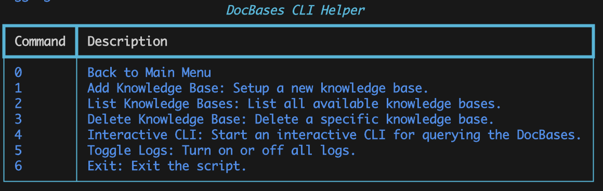

# DocBases

**Intelligent Answers from Any Document**

An advanced document querying system that combines agentic workflows, RAG patterns (Corrective, Adaptive, & Multi-Agent), and semantic intelligence to provide accurate, context-aware answers from your knowledge bases.



## Quick Start

### Installation

```bash
# Clone repository
git clone https://github.com/luongnv89/doc-bases.git
cd doc-bases

# Create virtual environment
python3.10 -m venv venv
source venv/bin/activate  # On Windows: venv\Scripts\activate

# Install dependencies
pip install -r requirements.txt

# Copy environment template
cp .env.example .env
```

### Basic Usage

```bash
# Start the application
python src/main.py
```

Then in the CLI:
1. **Setup RAG** - Load documents from GitHub repos, local files, websites, or download URLs
2. **Interactive CLI** - Query your knowledge bases with natural language
3. **Manage Knowledge Bases** - List, delete, or switch between bases

## Key Features

- **Multi-RAG Modes**: Switch between Basic, Corrective, Adaptive, and Multi-Agent modes
- **Advanced Document Processing**: Docling parser for PDFs with table extraction, semantic chunking
- **Intelligent Query Routing**: Adaptive RAG routes simple/complex/web queries optimally
- **Self-Correcting**: Corrective RAG validates retrieval, triggers web search if needed
- **Multi-Agent Orchestration**: Specialized agents (Retriever, Summarizer, Critic) with supervisor
- **Persistent Memory**: SQLite-backed session storage with resumable conversations
- **Performance Observability**: LangSmith integration, metrics dashboard, query logging

## Documentation

- **[Architecture Guide](docs/ARCHITECTURE.md)** - System design, RAG patterns, agent workflows
- **[API Reference](docs/API.md)** - Component interfaces, configuration, environment variables
- **[Development Guide](docs/DEVELOPMENT.md)** - Setup, testing, contributing guidelines
- **[Deployment Guide](docs/DEPLOYMENT.md)** - Production deployment, scaling considerations
- **[Component Details](src/README.md)** - Module documentation and specific components

## System Architecture

```
┌─────────────────────────────────────────────────────┐
│            Interactive CLI Interface                 │
└────────────────────┬────────────────────────────────┘
                     │
        ┌────────────┼────────────┐
        │            │            │
   ┌────▼──┐   ┌────▼──┐   ┌────▼──┐
   │ Basic │   │Correct.│   │Adaptive│   ┌──────────┐
   │  RAG  │   │  RAG   │   │  RAG   │───│Multi-Agt │
   └────┬──┘   └────┬──┘   └────┬──┘   └──────────┘
        │           │            │
        └───────────┼────────────┘
                    │
        ┌───────────▼────────────┐
        │   Document Retrieval    │
        │   & Embedding Layer     │
        └───────────┬────────────┘
                    │
        ┌───────────▼────────────┐
        │    ChromaDB Vector      │
        │        Store           │
        └────────────────────────┘
```

For detailed architecture, see [docs/ARCHITECTURE.md](docs/ARCHITECTURE.md).

## Configuration

Key environment variables (see `.env.example` for complete list):

```env
# LLM Provider
LLM_PROVIDER=ollama          # Options: ollama, openai, google, groq
LLM_MODEL=llama3.1:8b

# RAG Mode
RAG_MODE=adaptive            # Options: basic, corrective, adaptive, multi_agent

# Document Processing
USE_DOCLING=true
CHUNKING_STRATEGY=semantic   # Options: recursive, semantic

# Persistence
USE_PERSISTENT_MEMORY=true
CHECKPOINT_DB_PATH=knowledges/checkpoints.db

# Observability
LANGSMITH_TRACING=false
```

See [docs/API.md](docs/API.md) for all configuration options.

## Use Cases

### 1. Research & Knowledge Base Queries
Load documentation, research papers, or knowledge bases and ask complex questions with multi-step reasoning.

### 2. Document Analytics
Analyze large document collections with semantic chunking and specialized agents for summarization.

### 3. Real-time Information
Enable Adaptive RAG's web search for current events and external information not in your documents.

### 4. Quality Assurance
Use Corrective RAG's hallucination detection and critic agent to ensure answer accuracy.

## Project Structure

```
doc-bases/
├── src/
│   ├── agents/              # Multi-agent system (Retriever, Summarizer, Critic, Supervisor)
│   ├── graphs/              # LangGraph RAG workflows (Corrective, Adaptive)
│   ├── evaluation/          # RAG quality evaluation (relevance grading, hallucination check)
│   ├── tools/               # Specialized tools (web search)
│   ├── checkpointing/       # Persistent memory (SQLite)
│   ├── observability/       # Monitoring (LangSmith, metrics)
│   ├── models/              # LLM and Embedding interfaces
│   ├── utils/               # Document loading, RAG utilities, logging
│   └── main.py              # CLI entry point
├── docs/                    # Comprehensive documentation
├── tests/                   # Test suite
├── MODERNIZATION_PLAN.md    # Implementation roadmap (5 phases)
└── requirements.txt         # Python dependencies
```

See [src/README.md](src/README.md) for detailed component breakdown.

## Performance

Typical metrics (varies by model & hardware):

| Operation | Latency | Notes |
|-----------|---------|-------|
| Document Ingestion | ~100ms/doc | Includes parsing, embedding, storage |
| Simple Query | 200-800ms | Direct retrieval + generation |
| Complex Query | 1-3s | Multi-step with sub-queries |
| Web Search Fallback | 2-5s | Corrective RAG when needed |
| Critic Validation | +500ms | Multi-Agent mode refinement |

## Contributing

See [docs/DEVELOPMENT.md](docs/DEVELOPMENT.md) for:
- Setting up development environment
- Running tests and linting
- Code structure conventions
- Submitting contributions

## License

MIT License - see [LICENSE](LICENSE) for details

## Support

- **Issues**: [GitHub Issues](https://github.com/luongnv89/doc-bases/issues)
- **Documentation**: [docs/](docs/)
- **Examples**: See CLI interactive mode for walkthrough

---

**Status**: Production-ready v2.0 with advanced RAG patterns and multi-agent orchestration
**Last Updated**: January 2026
