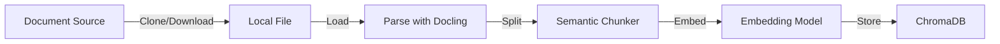
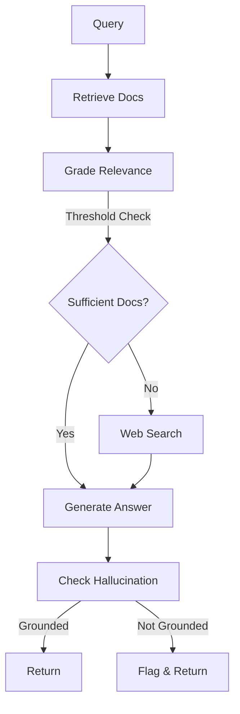
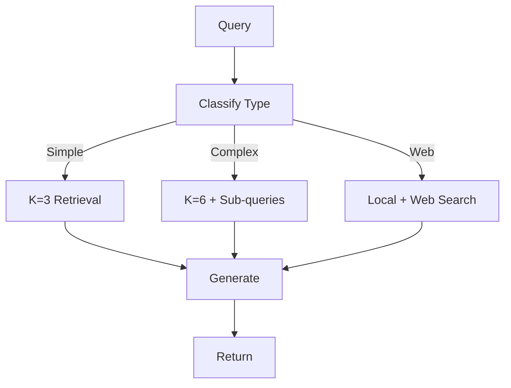
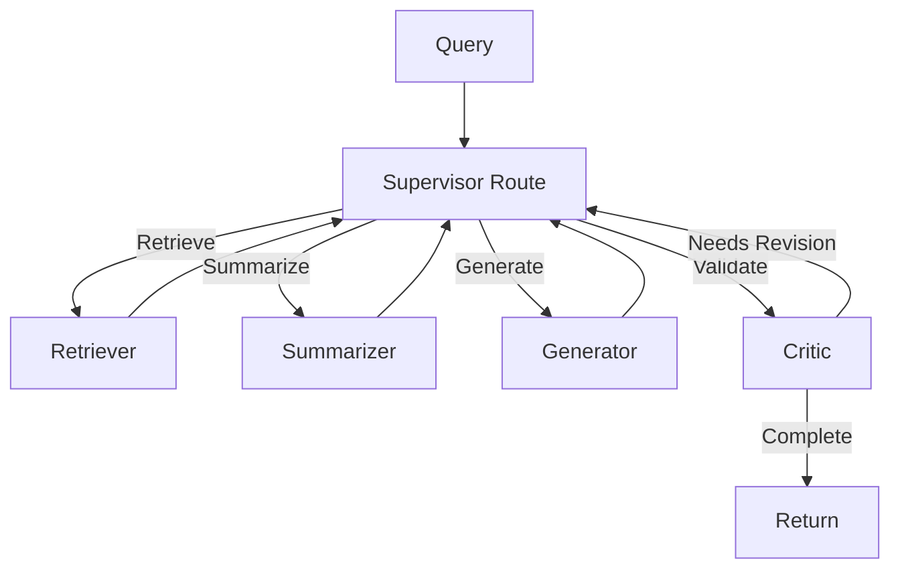

# Architecture Guide

## System Overview

DocBases is a sophisticated RAG system built on **LangChain 1.2+** and **LangGraph 1.0** that implements multiple retrieval strategies through a pluggable architecture.

### Core Principles

1. **Modularity**: Each RAG pattern is independent and selectable
2. **Extensibility**: New agents and tools integrate seamlessly
3. **Observability**: Built-in tracing and metrics at every layer
4. **Robustness**: Fallback mechanisms and error handling throughout

## System Layers

### 1. CLI Interface (`src/main.py`)

Entry point providing:
- Knowledge base management (create, list, delete)
- Mode selection (Basic, Corrective, Adaptive, Multi-Agent)
- Interactive query interface with session persistence
- Metrics dashboard

### 2. RAG Orchestration Layer

#### Mode Selection (`src/utils/rag_utils.py`)

Routes to appropriate RAG implementation based on `RAG_MODE` environment variable:

```python
RAG_MODE options:
  - basic       → ReAct agent with simple retrieval
  - corrective  → CRAG with relevance grading & web search
  - adaptive    → Query routing (simple/complex/web)
  - multi_agent → Supervisor with specialized agents
```

### 3. RAG Implementation Patterns

#### 3.1 Basic RAG (`src/utils/rag_utils.py`)

**When to use**: Simple factual queries, fast responses, minimal overhead

```
Query → Retriever → Generator → Answer
```

- Direct vector similarity retrieval
- Single LLM call for generation
- No validation or fallbacks
- ~200-800ms latency

#### 3.2 Corrective RAG (CRAG) (`src/graphs/corrective_rag.py`)

**When to use**: When answer quality matters more than speed, need hallucination detection

```
Query → Retrieve → Grade Docs → [If poor] Web Search → Generate → Check Hallucination
```

**Features**:
- LLM-based relevance grading (0.0-1.0 score)
- Web search fallback for insufficient documents
- Hallucination detection
- Grounding validation

**Configuration**:
```python
relevance_threshold: float = 0.5      # Doc relevance cutoff
min_relevant_docs: int = 1             # Minimum docs before web search
```

**Workflow**:
1. Retrieve top-K documents from vectorstore
2. Grade each document's relevance to query
3. If relevant docs < threshold → web search fallback
4. Generate answer from combined sources
5. Check answer is grounded in documents
6. Return validated answer

#### 3.3 Adaptive RAG (`src/graphs/adaptive_rag.py`)

**When to use**: Mixed workloads, cost optimization, performance scaling

```
Query → Classify Type → [Simple: K=3] / [Complex: K=6 + sub-queries] / [Web: hybrid] → Generate
```

**Classification Strategy**:
- **Simple**: Factual questions, single document lookup
- **Complex**: Reasoning, multiple documents, synthesis
- **Web**: Current events, external information

**Configuration**:
```python
retrieval_strategies:
  simple:   K=3  retrieval calls = 1
  complex:  K=6  retrieval calls = 1 + N sub-queries
  web:      K=2 local + web search
```

**Sub-query Generation** (for complex):
- LLM generates 2-3 related sub-queries
- Execute sub-queries in parallel
- Deduplicate and combine results
- Rerank before generation

#### 3.4 Multi-Agent RAG (`src/agents/supervisor.py`)

**When to use**: Maximum quality, complex reasoning, iterative refinement

```
Supervisor → [Retriever | Summarizer | Generator | Critic] → Iterate (max 3 loops) → Final Answer
```

**Agent Roles**:

| Agent | Role | Decisions |
|-------|------|-----------|
| Retriever | Document retrieval & decomposition | When to fetch more docs, query decomposition |
| Summarizer | Query-focused summarization | Map-reduce for large doc sets |
| Generator | Answer generation | Format and structure |
| Critic | Quality validation | Accuracy/completeness scoring, revision suggestions |
| Supervisor | Orchestration | Next agent routing, iteration control |

**Iterative Refinement**:
1. Supervisor routes to next agent based on state
2. Critic validates answers
3. If needs_revision AND iteration < max_iterations → revise
4. Otherwise → finalize and return

**Configuration**:
```python
max_iterations: int = 3        # Max refinement loops
relevance_threshold: float = 0.5
```

### 4. Document Processing Layer

#### Document Loading (`src/utils/document_loader.py`)

**Source Types**:
- GitHub repositories (git clone + file extraction)
- Local files (with MIME-type detection)
- Local folders (recursive traversal)
- Websites (HTML/text extraction)
- Downloadable files (temporary caching)

**Processing Pipeline**:
```
Source → Load → Parse [Docling|Fallback] → Split [Semantic|Recursive] → Embed → Store
```

#### File Change Detection (`src/utils/kb_metadata.py`)

**Purpose**: Track source file changes and automatically detect when knowledge bases need updating

**Features**:
- **Metadata Storage**: Stores file information (path, size, modification time, hash) in `knowledges/{kb_name}/metadata.json`
- **Change Types Detected**:
  - **Added Files**: New files in source directory
  - **Modified Files**: Existing files with changed content
  - **Deleted Files**: Files removed from source
- **Automatic Prompts**: User prompted when source changes detected on next query
- **Smart Updates**: Only re-indexes changed files (partial updates)
- **Metadata Format**:
  ```json
  {
    "kb_name": "My KB",
    "source": "/path/to/source",
    "created_at": "2026-01-21T10:00:00",
    "last_updated": "2026-01-21T14:30:00",
    "files": [
      {
        "path": "document.pdf",
        "size": 2048000,
        "mtime": 1674316800,
        "hash": "sha256:abc123..."
      }
    ]
  }
  ```
- **Usage Example**:
  ```bash
  # Automatic detection on query
  docb query interactive --kb "My KB"
  # → Detects changes in source directory
  # → Prompts: "3 files changed. Update KB? [y/n]"

  # Manual check
  docb kb info "My KB"  # Shows change summary
  ```

#### Docling Integration (`src/utils/docling_loader.py`)

Advanced document parsing for structured formats:

**Supported Formats**: PDF, DOCX, PPTX, XLSX, HTML, Markdown, Images

**Features**:
- Table extraction (preserves structure)
- Formula recognition
- Layout analysis
- Multi-page documents

**Feature Flag**: `USE_DOCLING=true` in `.env`

#### Semantic Chunking (`src/utils/semantic_splitter.py`)

Alternative to character-based splitting for better semantic coherence:

**Strategy**: Embedding-based boundaries
```python
breakpoint_type options:
  - percentile           (default: 95th percentile)
  - standard_deviation
  - interquartile
```

**Advantage**: Preserves topic coherence, reduces fragmentation

### 5. Retrieval & Embedding Layer

#### Vector Store (`src/utils/rag_utils.py`)

**Provider**: ChromaDB 1.4+ with persistent storage

**Storage Location**: `knowledges/{knowledge_base_name}/`

**Index Type**: Cosine similarity by default

**Retrieval Configuration**:
```python
search_kwargs = {
  "k": 3-6,              # Number of documents
  "fetch_k": 20,         # Pre-filter pool
  "lambda_mult": 0.25    # MMR diversity
}
```

#### Embeddings (`src/models/embeddings.py`)

**Providers**:
- Ollama (local, free)
- OpenAI (GPT-3.5-turbo, gpt-4)
- Google (Gemini Embedding)

**Configuration**:
```env
EMB_PROVIDER=ollama
EMB_MODEL=nomic-embed-text
EMB_API_BASE=http://localhost:11434
```

### 6. LLM Layer (`src/models/llm.py`)

**Providers**:
- Ollama (local)
- OpenAI (GPT-3.5, GPT-4)
- Google (Gemini)
- Groq (ultra-fast)

**Configuration**:
```env
LLM_PROVIDER=ollama
LLM_MODEL=llama3.1:8b
LLM_API_BASE=http://localhost:11434
```

**Temperature Settings**:
- Generation: 0.7 (balanced creativity)
- Grading: 0.0 (deterministic)
- Routing: 0.3 (consistent classification)

### 7. Evaluation & Quality Layer

#### RAG Evaluator (`src/evaluation/rag_evaluator.py`)

**Components**:

1. **Relevance Scoring**
   - Grades document relevance (0.0-1.0)
   - Used by Corrective RAG for filtering
   - Threshold: 0.5

2. **Hallucination Detection**
   - Checks answer grounding
   - Lists unsupported claims
   - Used by Corrective RAG
   - Used by Critic agent

3. **Batch Processing**
   - Grade multiple documents
   - Split into relevant/irrelevant

### 8. Tool Integration Layer

#### Web Search (`src/tools/web_search.py`)

**Provider**: DuckDuckGo (no API key required)

**Usage**:
- Corrective RAG fallback
- Adaptive RAG web routing
- Real-time information

**Configuration**:
```python
max_results: int = 3    # Results per query
timeout: int = 5        # Seconds
```

### 9. Persistence Layer

#### SQLite Checkpointer (`src/checkpointing/sqlite_saver.py`)

**Purpose**: Thread-safe session persistence using SQLite

**Features**:
- WAL mode for concurrent access
- Session listing and cleanup
- Automatic old session deletion

**Configuration**:
```env
USE_PERSISTENT_MEMORY=true
CHECKPOINT_DB_PATH=knowledges/checkpoints.db
```

**Database Schema**:
```sql
-- LangGraph maintains automatically
checkpoints (
  thread_id TEXT,
  checkpoint_id TEXT,
  parent_checkpoint_id TEXT,
  type_id TEXT,
  checkpoint BLOB,
  metadata BLOB,
  created_at TIMESTAMP
)
```

### 10. Observability Layer

#### LangSmith Integration (`src/observability/langsmith_tracer.py`)

**Purpose**: Distributed tracing for debugging and optimization

**Traces Capture**:
- All LLM calls
- Tool execution
- Agent decisions
- Retrieval operations

**Configuration**:
```env
LANGSMITH_TRACING=true
LANGSMITH_API_KEY=ls_...
LANGSMITH_PROJECT=doc-bases
```

#### Metrics Tracking (`src/observability/metrics.py`)

**Tracked Metrics**:
- Query latency
- Retrieval count
- Success/failure rate
- Mode distribution
- Error analysis

**Aggregation**:
- Daily averages
- Mode-specific stats
- Time-range filtering

**Dashboard**:
```
Queries: 1,245 | Success: 98.5% | Avg Latency: 1,240ms
Mode: corrective (412) | adaptive (623) | multi_agent (210)
```

## Data Flow Diagrams

### 1. Document Ingestion



### 2. Query Processing - Corrective RAG



### 3. Query Processing - Adaptive RAG



### 4. Multi-Agent Workflow



## Configuration Management

### Environment Variables Hierarchy

```
System Default
    ↓
.env.example (Reference)
    ↓
.env (User overrides)
    ↓
Runtime env vars (Highest priority)
```

### Key Configurations

**RAG Mode Selection**:
```env
RAG_MODE=adaptive
```

**Document Processing**:
```env
USE_DOCLING=true
CHUNKING_STRATEGY=semantic
```

**Persistence**:
```env
USE_PERSISTENT_MEMORY=true
CHECKPOINT_DB_PATH=knowledges/checkpoints.db
```

**Observability**:
```env
LANGSMITH_TRACING=false
```

## Performance Characteristics

### Latency Breakdown (ms)

**Basic RAG** (Simple query):
- Retrieve: 100-200ms
- Generate: 100-600ms
- **Total**: 200-800ms

**Corrective RAG** (With validation):
- Retrieve: 100-200ms
- Grade docs: 200-400ms (N docs)
- Generate: 100-600ms
- Hallucination check: 200-400ms
- **Total**: 600-1,600ms
- **Web fallback**: +2,000-4,000ms

**Adaptive RAG** (Complex query):
- Classify: 100-200ms
- Retrieve: 100-300ms
- Sub-queries: 200-600ms (if complex)
- Generate: 100-600ms
- **Total**: 500-1,700ms

**Multi-Agent** (Iterative):
- Per iteration: 1,000-2,000ms
- Typical: 2-3 iterations
- **Total**: 2,000-6,000ms

### Resource Requirements

**Memory**:
- Vector store: ~100MB per 1,000 docs
- Model weights: varies (8B-70B)
- Runtime: 2-4GB base

**Storage**:
- ChromaDB: ~100MB per 1,000 docs
- SQLite checkpoints: <1MB per 100 sessions
- Metrics DB: ~1MB per 10,000 queries

## Advanced Features Guide

### KB File Change Detection

**Scenario**: You have a knowledge base from documents that get updated regularly.

**Traditional Approach**: Need to manually delete and re-create KB each time

**DocBases Solution**: Automatic change detection!

**How It Works**:

1. **First Load**: Creates `metadata.json` with all file hashes and timestamps
2. **Subsequent Queries**: Compares current files against metadata
3. **Change Detection**:
   - Calculates SHA256 of files
   - Compares sizes and modification times
   - Reports: "3 added, 2 modified, 1 deleted"
4. **User Prompted**: "Update knowledge base? [y/n]"
5. **Smart Update**: Only re-processes changed files

**Example Workflow**:
```bash
# Week 1: Create KB from docs
docb kb add folder ./docs --name "Project Docs"
# → Creates metadata.json

# Week 2: One doc was updated
docb query interactive --kb "Project Docs"
# → Detects: 1 file modified
# → Prompts: "1 file changed. Update KB? [y/n]"
# → Y: Re-indexes only changed file (fast)

# Week 3: New documentation added
docb kb info "Project Docs"
# → Shows: "2 added files detected"
# → Suggests re-indexing
```

### Semantic Chunking vs. Character-Based

**Character-Based (Default)**:
```
Splits at fixed sizes (1000 chars)
- Fast processing
- Simple implementation
- May break in middle of sentences/topics
```

**Semantic Chunking** (Enable: `CHUNKING_STRATEGY=semantic`):
```
Splits based on embedding similarity
- Preserves topic coherence
- Better retrieval quality
- Slightly slower processing
- Recommended for quality-focused scenarios
```

**Example**:
```
Document: "...[topic A content]... Now let's discuss [topic B content]..."

Character split (breaks mid-sentence):
  Chunk 1: "...[topic A]...Now let's"
  Chunk 2: "discuss [topic B]..."  ❌ Broken context

Semantic split (natural boundaries):
  Chunk 1: "...[complete topic A]..."
  Chunk 2: "[complete topic B]..."  ✅ Coherent chunks
```

### Docling vs. Standard Parsing

**Standard PDF Parsing**: Text extraction, basic formatting

**Docling Integration** (Enable: `USE_DOCLING=true`):
```
- Table structure preservation
- Formula recognition (LaTeX, MathML)
- Layout analysis
- Column detection
- Header/footer handling
- Multi-page context
```

**When to Use Docling**:
- ✅ Technical documents with formulas
- ✅ Reports with complex tables
- ✅ Academic papers
- ✅ Documents requiring precise layout

**When Basic Parsing Sufficient**:
- ✅ Plain text files
- ✅ Simple documentation
- ✅ Blog posts/articles
- ✅ When speed is critical

### Multi-Agent RAG with Iterative Refinement

**Scenario**: You need the highest quality answers with multiple passes

**How It Works**:
```
Iteration 1:
  Supervisor → Retriever (find docs)
             → Summarizer (condense)
             → Generator (create answer)
             → Critic (evaluate)

Iteration 2 (if needed):
  Critic feedback: "Incomplete on point X"
  Supervisor → Generator (revise)
             → Critic (re-evaluate)

Iteration 3 (max):
  Final answer returned
```

**Critic Scores** (each 0.0-1.0):
- Accuracy: How correct is the information?
- Completeness: Are all aspects covered?
- Clarity: Is it well-explained?

**Configuration**:
```bash
# Set max iterations
docb config set multi_agent.max_iterations 5

# Or in code:
from src.agents.supervisor import MultiAgentSupervisor
supervisor = MultiAgentSupervisor(
    vectorstore=vs,
    llm=llm,
    max_iterations=5  # Try up to 5 refinement passes
)
```

### Web Search Integration

**When Activated**:
- **Corrective RAG**: If insufficient relevant documents (< min_relevant_docs)
- **Adaptive RAG**: When query routed to "web" category
- **Multi-Agent**: Can be integrated in retriever

**Example - Corrective RAG**:
```
Query: "What are the latest AI trends in 2026?"
KB: Contains 2024 documentation

Flow:
  1. Retrieve docs (finds 2024 content)
  2. Grade relevance (scores low - old)
  3. Trigger web search (current info)
  4. Combine: KB context + web results
  5. Generate comprehensive answer
```

**Configuration**:
```bash
# Enable web search in Corrective RAG
docb config set corrective_rag.min_relevant_docs 3

# If found docs < 3, web search triggered
```

## Extension Points

### Adding New RAG Modes

1. Create graph class in `src/graphs/{mode}_rag.py`
2. Implement required methods (retrieve, generate, etc.)
3. Add routing in `src/utils/rag_utils.py`
4. Update `RAG_MODE` option in `.env.example`

### Adding New Agents

1. Create agent class in `src/agents/{agent}_agent.py`
2. Implement tool functions
3. Import in `src/agents/__init__.py`
4. Integrate with supervisor if needed

### Adding New Tools

1. Create tool in `src/tools/{tool}.py`
2. Use `@tool` decorator from LangChain
3. Export in `src/tools/__init__.py`
4. Register with appropriate RAG mode

## Testing Strategy

### Unit Tests
- Individual components (embeddings, chunking, etc.)
- Tool functions
- Utility functions

### Integration Tests
- RAG mode workflows
- Agent interactions
- End-to-end document ingestion

### Quality Tests
- Hallucination detection accuracy
- Relevance grading consistency
- Query routing correctness

See [docs/DEVELOPMENT.md](DEVELOPMENT.md) for test execution.

## Deployment Architecture

### Development
- Local LLM (Ollama)
- SQLite storage
- In-process execution

### Production
- API-based LLM (OpenAI, Groq)
- Network isolation
- Containerized deployment
- LangSmith observability
- Metrics aggregation

See [docs/DEPLOYMENT.md](DEPLOYMENT.md) for details.

---

**Last Updated**: January 2026
**Architecture Version**: 2.0
